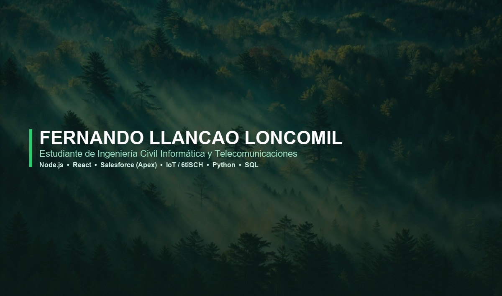

<!-- ==========================================
  HEADER BANNER / PORTADA
  ========================================== -->
<div align="center">
  

  <br/><br/>

  <!-- ANIMATED TYPING HEADER -->
  <a href="https://git.io/typing-svg">
    
  </a>

  <br/>

  <!-- QUICK BADGES -->
  <p align="center">
    
    
    
  </p>
</div>

<hr style="border: 1px solid #2ecc71; opacity: 0.3;" />

<!-- ==========================================
  SOBRE MÍ / ABOUT ME
  ========================================== -->
## 🌿 Sobre Mí / About Me

```yaml
Estudiante: Ingeniería Civil Informática y Telecomunicaciones (5° año)
Institución: Universidad Diego Portales (UDP) - Santiago, Chile
Enfoque: Desarrollo de Software, Soluciones Salesforce CRM, Redes IoT & Análisis de Datos
Estado Actual: En búsqueda de oportunidades profesionales y proyectos desafiantes
```

Estudiante en quinto año apasionado por la **creación de soluciones digitales eficientes, escalables y orientadas al impacto real**. Cuento con experiencia en desarrollo web Full-Stack (**Node.js** y **React**), administración y desarrollo personalizado en **Salesforce CRM (Apex & Flow Builder)**, e investigación aplicada en **redes de sensores inalámbricos e IoT (protocolo BDPC sobre 6tiSCH)**.

- 🔭 **Actualmente trabajando en:** Optimización y análisis de datos para soluciones digitales e infraestructura de redes.
- 🎓 **Formación:** Software, Arquitectura de Sistemas, Redes de Computadores, Fibra Óptica, Redes Celulares, Ciberseguridad, IA y Sistemas Distribuidos.
- 💡 **Intereses:** Digitalización y automatización de procesos, redes IIoT, soluciones software sostenibles y transformación digital.

---

<!-- ==========================================
  HABILIDADES TÉCNICAS / SKILLS
  ========================================== -->
## 🛠️ Habilidades Técnicas / Technical Skills

### 💻 Stack de Tecnologías & Iconos
<p align="center">
  <a href="https://skillicons.dev">
    
  </a>
</p>

### 📊 Desglose de Competencias

<table>
  <tr>
    <td width="50%" valign="top">
      <h3>🌐 Desarrollo Software & Web</h3>
      <ul>
        <li><b>Node.js & Express:</b> Backend, construcción de APIs RESTful.</li>
        <li><b>React & JavaScript / TS:</b> Interfaces modernas y dinámicas.</li>
        <li><b>Python:</b> Análisis de datos, automatización y scripts.</li>
        <li><b>Java & C / C++:</b> Programación orientada a objetos y de bajo nivel.</li>
        <li><b>Bases de Datos & SQL:</b> PostgreSQL, diseño de esquemas y consultas.</li>
      </ul>
    </td>
    <td width="50%" valign="top">
      <h3>⚡ Salesforce CRM</h3>
      <ul>
        <li><b>Desarrollo Apex:</b> Clases Apex, triggers, pruebas unitarias.</li>
        <li><b>Automatización de Procesos:</b> Flow Builder avanzado.</li>
        <li><b>Configuración CRM:</b> Objetos personalizados, campos y validaciones.</li>
        <li><b>Gestión de Seguridad:</b> Layouts, tipos de registro y permisos.</li>
        <li><b>Analytics:</b> Creación de Reportes y Dashboards personalizados.</li>
      </ul>
    </td>
  </tr>
  <tr>
    <td width="50%" valign="top">
      <h3>📡 Redes, IoT & Telecomunicaciones</h3>
      <ul>
        <li><b>Protocolos IoT & WSN:</b> Protocolo BDPC y simulador 6tiSCH.</li>
        <li><b>Sistemas Operativos:</b> Linux / Bash Scripting.</li>
        <li><b>Redes:</b> Protocolos de comunicación, Fibra Óptica, Celulares.</li>
        <li><b>Infraestructura:</b> Sistemas distribuidos y ciberseguridad.</li>
      </ul>
    </td>
    <td width="50%" valign="top">
      <h3>🛠️ Herramientas & Otros</h3>
      <ul>
        <li><b>Control de Versiones:</b> Git / GitHub (Control de versiones).</li>
        <li><b>Análisis de Datos:</b> Excel Intermedio (Santander Academy).</li>
        <li><b>Metodologías:</b> Scrum / Metodologías Ágiles.</li>
        <li><b>Idiomas:</b> Español (Nativo) | Inglés (Intermedio).</li>
      </ul>
    </td>
  </tr>
</table>

---

<!-- ==========================================
  EXPERIENCIA Y FORMACIÓN
  ========================================== -->
## 💼 Experiencia & Proyectos / Experience

```
├── 🔬 Práctica Investigativa | Universidad Diego Portales (Mar. 2026 - Jul. 2026)
│   └── Investigación y optimización del protocolo BDPC mediante el simulador 6tiSCH en redes de sensores inalámbricos (IoT).
│
├── ☁️ Práctica I Soporte de Proyectos Salesforce CRM | Seidor Chile (Feb. 2024 - Jul. 2024)
│   ├── Configuración de objetos personalizados, reglas de validación y flujos automatizados con Flow Builder.
│   ├── Análisis, depuración y corrección de clases Apex y ejecución de pruebas unitarias.
│   └── Levantamiento de requerimientos y construcción de Dashboards y Reportes ejecutivos.
│
└── 🎓 Ingeniería Civil Informática y Telecomunicaciones | Universidad Diego Portales (2021 - Presente)
    └── Formación avanzada en desarrollo de software, arquitectura de sistemas, redes e inteligencia artificial.
```

---

<!-- ==========================================
  HABILIDADES BLANDAS
  ========================================== -->
## 🧠 Habilidades Blandas / Soft Skills

<p align="left">
  
  
  
  
  
</p>

---

<!-- ==========================================
  ESTADÍSTICAS DE GITHUB
  ========================================== -->
## 📈 Estadísticas de GitHub / GitHub Stats

<div align="center">
  <table border="0">
    <tr>
      <td>
        
      </td>
      <td>
        
      </td>
    </tr>
  </table>
</div>

---

<!-- ==========================================
  CONTACTO / CONNECT WITH ME
  ========================================== -->
## 📬 Conectemos / Connect with Me

<div align="center">
  <a href="mailto:fernando.llancao@mail.udp.cl">
    
  </a>
  &nbsp;&nbsp;
  <a href="https://www.linkedin.com/in/">
    
  </a>
  &nbsp;&nbsp;
  <a href="https://github.com/KovacTs">
    
  </a>
</div>

<br/>

<div align="center">
  <sub>Diseñado con 💚 para el perfil de GitHub de <b>Fernando Llancao Loncomil</b>.</sub>
</div>
